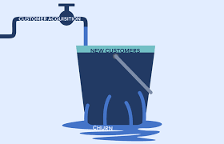

# Telecom-Churn-Study
In the telecom industry, customers are able to choose from multiple service providers and actively switch from one operator to another. In this highly competitive market, the telecommunications industry experiences an average of 15-25% annual churn rate. Given the fact that it costs 5-10 times more to acquire a new customer than to retain an existing one, customer retention has now become even more important than customer acquisition.

For many incumbent operators, retaining high profitable customers is the number one business goal.

To reduce customer churn, telecom companies need to predict which customers are at high risk of churn.

In this project, you will analyse customer-level data of a leading telecom firm, build predictive models to identify customers at high risk of churn and identify the main indicators of churn.

## Definitions of Churn

There are various ways to define churn, such as:

1. Revenue-based churn: Customers who have not utilised any revenue-generating facilities such as mobile internet, outgoing calls, SMS etc. over a given period of time. One could also use aggregate metrics such as ‘customers who have generated less than INR 4 per month in total/average/median revenue’.

2. Usage-based churn: Customers who have not done any usage, either incoming or outgoing - in terms of calls, internet etc. over a period of time.

I have used the usage-based definition to define churn.

## Understanding Customer Behaviour During Churn

There are three phases of customer lifecycle :

1. Good Phase : In this phase, the customer is happy with the service and behaves as usual.

2. Action Phase:  In this phase, the customer usually shows different behaviour than the ‘good’ months. Also, it is crucial to identify high-churn-risk customers in    this phase, since some corrective actions can be taken at this point.

3. Churn Phase: In this phase, the customer is said to have churned. You define churn based on this phase. At the time of prediction (i.e. the action months), this    data is not available for prediction. Thus, after tagging churn as 1/0 based on this phase, we discard all data corresponding to this phase.

